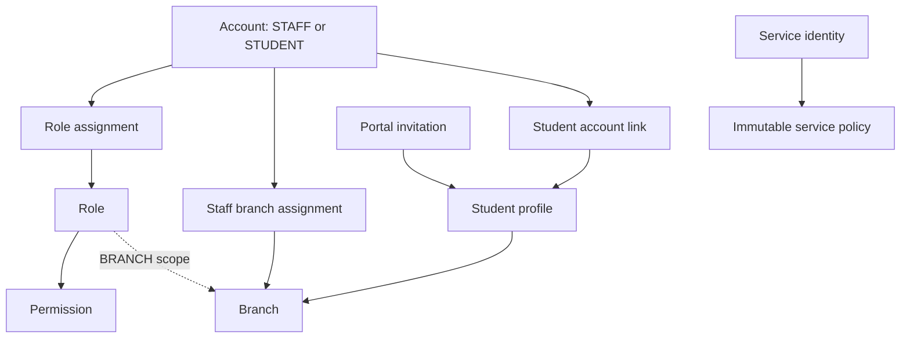
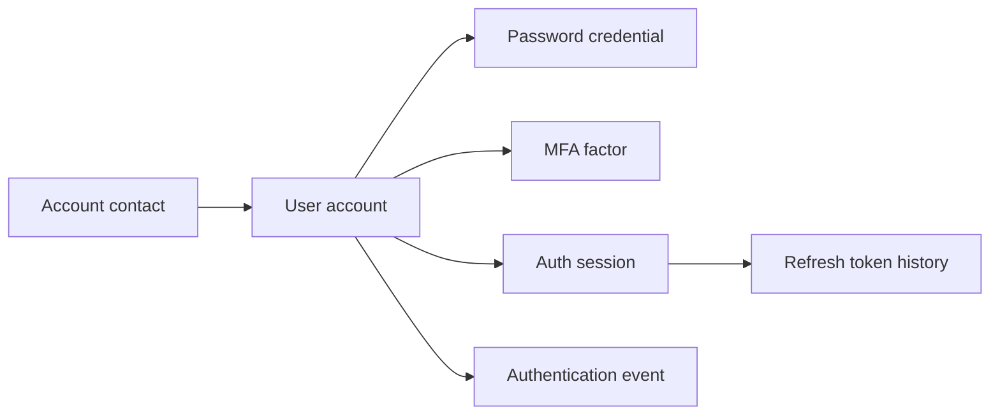
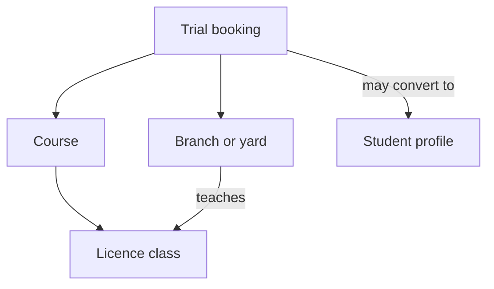

# Domain Model

[<- Backend Architecture](README.md)

## Domain ownership

| Domain | Owns |
| --- | --- |
| `booking` | Trial booking leads, callback status, claim/dismiss/convert workflow |
| `school` | School profile, catalogue, branches, branch lifecycle, and public school rules |
| `student` | Student profiles, enrolment, profile lifecycle, and student-owned operational data |
| `user` | Staff/student account identity and non-credential user profile data |
| `auth` | Credentials, MFA, login, sessions, invitations, permissions, roles, assignments, authorization revisions, and service identities |
| `config` | Spring configuration and security wiring |
| `common` | Shared DTOs, exceptions, mappers, utilities, and cross-domain value types only |

Do not create a domain package until behavior requires it. Keep workflow logic in the
owning domain and use explicit services or policies across domain boundaries. In
particular, `config.security` wires Spring Security while `auth` owns authentication and
authorization behavior.

## Core relationships



`STAFF` authorization follows role assignments and, for branch scope, a matching staff
branch assignment. `STUDENT` authorization follows the one active account link and the
protected `student_default` role. Service identities are independent principals and never
enter the user-role graph.

## Authorization records

| Record | Required model constraints |
| --- | --- |
| Account | Immutable `STAFF` or `STUDENT` type; server-managed lifecycle and authorization version |
| Account contact | Verified active contact may be a login identifier; retired contacts remain historical |
| Password credential | One active BCrypt password credential per account; secret is stored only as a hash and credential revision participates in session validation |
| MFA factor | Account-bound pending, active, or revoked factor; staff sign-in requires an active factor and factor-specific verification |
| Auth challenge | Hashed, single-use, expiring challenge for MFA, recovery, or comparable proof-of-control workflow |
| Auth session | Revocable server record with account ID, authorization/credential versions, idle and absolute expiry, and lifecycle state |
| Refresh token history | Hashed opaque token records linked to one session; `ACTIVE`, `REPLACED`, `REVOKED`, and `EXPIRED` states support rotation and replay detection |
| Permission | Immutable seed key, scope category, and delegation policy |
| Role | Immutable scope and branch binding; `ACTIVE` or irreversibly `INACTIVE`; role-policy revision |
| Role assignment | Immutable user/role/scope/branch binding; `ACTIVE` or irreversibly `ENDED` |
| Staff branch assignment | Immutable staff/branch binding; `ACTIVE` or irreversibly `ENDED` |
| Student account link | At most one active link per account and per student record |
| Portal invitation | Hashed single-use token, expiry, state, verified-contact binding, and one student target |
| Service identity | Independent principal, lifecycle, fixed branch context, immutable policy, and policy revision |
| Audit event | Append-only and tamper-evident; actor, action, target, reason, and before/after data where required |

Protected system-role identity is a server-managed type, not a client-selected code or
display name. There is one `school_super_admin`, one branch-bound `branch_super_admin`
instance per branch, and one `student_default` role.

The database must enforce at most one active staff branch assignment per staff/branch and
one active role assignment per user/role/scope/branch key. `SCHOOL` and `SELF` assignments
need a normalized no-branch key or scope-specific constraint so nullable branch IDs cannot
permit duplicates.

Assignment records and ownership are historical facts. They are ended, never mutated or
reactivated. Role scope, role branch, account type, and service policy are likewise not
generic update fields.

## Implemented login relationship



Login looks up an active verified login contact, verifies one active password credential,
and creates a session only after the account type's authentication requirements are met.
Student password login currently establishes the session. Staff password login instead
creates an MFA challenge until factor verification is delivered.

## Branch ownership

Every branch-owned record has one required server-controlled owner branch ID. This
includes students, vehicles, lessons, payments, documents, and later branch resources.

- Normal create derives or validates ownership against the actor's complete grant.
- Normal update authorizes against the stored owner branch and cannot change it.
- Normal relationships stay within one owner branch.
- A referenced staff member needs an active assignment to that branch.
- Cross-branch transfers and payment branch corrections are dedicated school-scoped,
  permission-specific, transactional, audited workflows.
- Branch deactivation ends staff branch assignments and attached branch role assignments;
  reactivation restores no historical entitlement.

## Student lifecycle

Student profile lifecycle is independent of account, contact verification, portal
invitation, account link, and branch lifecycle.

```text
REQUESTED -> REGISTERED -> VERIFIED -> ACTIVE -> GRADUATED
```

`INACTIVE`, `SUSPENDED`, and `TRANSFERRED_OUT` are explicit exceptional or historical
states. Every transition is a named workflow with a permission-and-scope policy. Generic
student create, update, import, and bulk requests cannot set or skip transitions.

A normal portal link requires an active owner branch, a verified contact, no active link,
and profile status `REGISTERED`, `VERIFIED`, or `ACTIVE`. Student `SELF` access also depends
on the current profile status and owner-branch lifecycle.

## Public catalogue and booking relationships



A trial booking begins as a public lead and requires no account or payment. Candidate
statuses remain draft contract values until implementation starts:

| Status | Meaning |
| --- | --- |
| `pending_callback` | Submitted and waiting for staff action |
| `claimed` | An authorized staff member has taken responsibility |
| `contacted` | Staff reached the visitor |
| `converted` | The lead became an enrolled student |
| `dismissed` | The lead is closed without enrolment |

## Booking rules to enforce first

- A booking can target only an active branch that teaches the course's licence class.
- Preferred start date cannot be in the past or more than one year out.
- Booking requires no account or payment.
- Phone number is collected only for confirming the lesson unless privacy copy changes.
- Callback deadline is two hours from submission unless the business qualifies it by
  opening hours.
- Protected callback operations authorize the booking's stored branch; a request branch
  selector is not authority.

## Product rules not yet settled

- Minimum age by licence class.
- Existing light-vehicle licence requirement for heavy classes.
- Course/package compatibility.
- Ownership when training and trial-test activity occur at different branches.

Do not silently add fields or enforcement for these. They remain product questions, not
implementation defaults.
