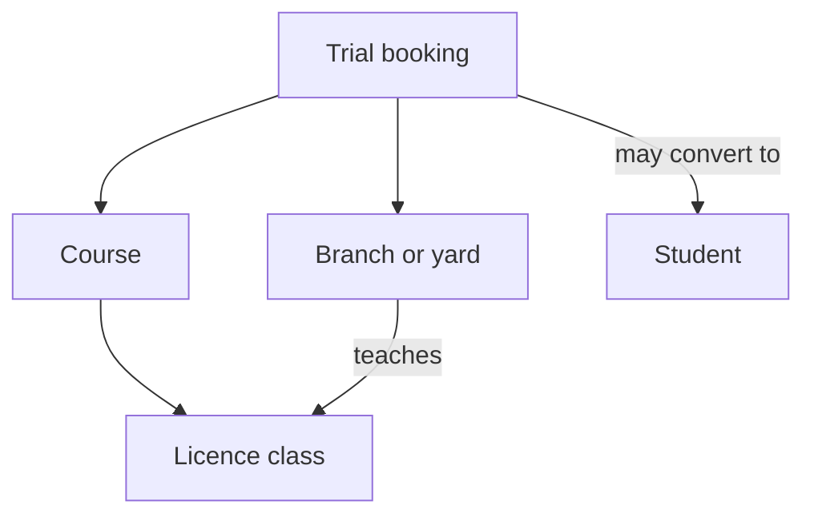

# Domain Model

[<- Backend Architecture](README.md)

## Initial Domains

| Domain | Owns |
| --- | --- |
| `booking` | Trial booking leads, callback status, claim/dismiss/convert workflow |
| `school` | School profile, licence classes, courses, packages, branches or yards, FAQs, testimonials, resources, and public catalogue rules |
| `student` | Enrolled students after a lead converts |
| `user` | Staff/student user accounts |
| `auth` | Login, token issuing, authentication workflows |
| `config` | Spring configuration and security wiring |
| `common` | Shared DTOs, exceptions, mappers, utilities |

Do not create a domain package until the backend needs behavior there. The `school` package is the initial home for public catalogue and school profile behavior because the frontend already exposes these as one cohesive content model. Keep the public ids aligned with the frontend data.

## Key Relationships

## Booking Status Draft

A trial booking begins as a lead waiting for callback. Candidate statuses:

| Status | Meaning |
| --- | --- |
| `pending_callback` | Submitted and waiting for staff action |
| `claimed` | A staff member has taken responsibility for callback |
| `contacted` | Staff reached the visitor |
| `converted` | Visitor became an enrolled student |
| `dismissed` | Lead is closed without enrolment |

Status names are draft contract values until implementation starts.

## Business Rules To Enforce First

- A booking can only target a branch that teaches the course's licence class.
- Preferred start date cannot be in the past or more than one year out.
- Booking does not require an account or payment.
- Phone number is collected only for confirming the lesson unless the privacy copy changes.
- Callback deadline is two hours from submission unless the business qualifies this by opening hours.

## Business Rules Not Yet Enforced By Current Form

- Minimum age by licence class.
- Existing light-vehicle licence requirement for heavy classes.
- Course/package compatibility.

Do not silently add fields or enforcement for these without product discussion. They are called out in the frontend architecture open questions.

