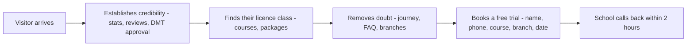

# Business requirements

[← Architecture](../README.md)

What Elven Driving School's web presence is meant to achieve, the rules the product has to
honour, and what is promised to a visitor.

> ### Provenance — read this first
>
> **These requirements were reconstructed from the built product**, not handed down from
> the business. Every statement here was derived from the implemented UI and the content
> catalogue in [`src/locales/en.json`](../../../src/locales/en.json) and
> [`src/data/school.ts`](../../../src/data/school.ts).
>
> That makes this a **draft for validation, not a signed-off specification.** Where the
> product states a commercial or regulatory commitment — pass rates, callback times,
> refund terms, age limits — this document records *what the site currently tells
> visitors*. It does not verify that the business can or does honour it. Confirm each one
> before treating it as a requirement, and see [Open questions](open-questions.md) for the
> items that most need an answer.

## Documents

| Document | Read it for |
| --- | --- |
| [Product scope](product-scope.md) | Goals, audiences, what is in and out of scope |
| [Functional requirements](functional-requirements.md) | Numbered `FR-*` catalogue, each with build status |
| [Domain and business rules](domain-and-rules.md) | Entities, the real catalogue values, numbered `BR-*` rules |
| [Non-functional requirements](non-functional.md) | Language parity, accessibility, privacy, performance |
| [Roles and permissions](roles-and-permissions.md) | *Proposal* — who signs in, what each role does, how access is modelled |
| [Open questions](open-questions.md) | Decisions the business must make before this site takes real leads |

Implementation lives one folder over, in [frontend architecture](../frontend/README.md).
Where a requirement here is enforced by specific code, the entry links to it.

## The business in one paragraph

Elven Driving School teaches learner drivers in Colombo across four locations and four
licence classes, from scooters to buses. Its commercial proposition is that it removes the
administrative burden of Sri Lankan licensing — the medical certificate, the Department of
Motor Traffic registration, the written examination and the trial-test vehicle are all
handled by the school — and that a prospective student can start with a **free trial
lesson with no payment, no account and no obligation to enrol**.

## What the site is for

The site is a **marketing and lead-capture front door**. Its single conversion goal is a
booked free trial lesson; every section exists to move a visitor toward that, or to remove
a reason not to.

Step F happens entirely off-site, by phone. **The site does not currently deliver the
booking anywhere** — see [FR-201](functional-requirements.md#lead-capture) — which is the
single largest gap between what visitors are promised and what the system does.

## Status summary

| Area | State |
| --- | --- |
| Content and discovery (courses, packages, journey, branches, reviews, FAQ) | Built, content served locally |
| Trilingual delivery (English, Sinhala, Tamil) | Built |
| Contact channels (hotline, WhatsApp, email, directions) | Built |
| Trial booking form | Built as UI; **submission goes nowhere** |
| Learning hub | Listing built; **resources have no destinations** |
| Legal pages, social profiles | **Placeholder links** |
| Student portal, payments, scheduling | Not built, referenced in copy |
