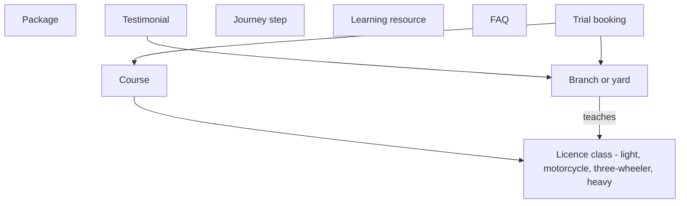

# Domain and business rules

[← Business requirements](README.md)

The entities the business deals in, the values currently published, and the rules that
govern them. The technical shape of these records is documented in
[state and data → the content layer](../frontend/state-and-data.md#the-content-layer); this
page is about their meaning.

## Entities

A **licence class** is the regulatory grouping; a **course** is what the school sells
against one; a **package** is a commercial bundle of lessons priced independently of any
one course. Note that courses and packages are **not linked in the data** — a visitor
chooses a course when booking a trial, but packages are presented as a separate pricing
decision. Whether that is intentional is [an open question](open-questions.md).

## Licence classes and courses

Four classes, eight courses. Prices are the full course in LKR.

| Course | Class | DMT code | Lessons | Weeks | Transmission | Price |
| --- | --- | --- | --- | --- | --- | --- |
| Car — Manual | Car & Van | Class B | 20 | 14 | Manual | 48,000 |
| Car — Automatic | Car & Van | Class B (auto) | 16 | 12 | Auto | 42,000 |
| Van & Crew Cab | Car & Van | Class B | 22 | 14 | Manual | 54,000 |
| Motorcycle | Motorcycle | Class A | 12 | 8 | Manual | 26,000 |
| Scooter | Motorcycle | Class A1 | 8 | 6 | Auto | 18,000 |
| Three-wheeler | Three-wheeler | Class B1 | 14 | 9 | Manual | 30,000 |
| Lorry | Lorry & Bus | Class C / CE | 26 | 18 | Manual | 96,000 |
| Bus & Coach | Lorry & Bus | Class D / DE | 28 | 20 | Manual | 108,000 |

## Packages

| Package | Price | Lessons | Per lesson | Positioning |
| --- | --- | --- | --- | --- |
| Essential | 34,000 | 12 | ~2,833 | Has driven before, needs the licence |
| **Complete** (most chosen) | 48,000 | 20 | 2,400 | Absolute beginner, nothing left out |
| Fast Track | 72,000 | 24 | 3,000 | Licensed in six weeks, deadline-driven |

## Locations

| Location | Kind | Teaches | Hours |
| --- | --- | --- | --- |
| Rajagiriya (head office) | Branch | All four classes | Mon–Sat 6.30–19.30, Sun 8.00–14.00 |
| Wellawatte | Branch | Car & Van, Motorcycle, Three-wheeler | Mon–Sat 7.30–20.00, Sun closed |
| Battaramulla | Branch | Car & Van, Motorcycle, Lorry & Bus | Mon–Sat 7.00–18.30, Sun 8.00–13.00 |
| Kaduwela Training Yard | Yard | Car & Van, Motorcycle, Three-wheeler | Daily 6.00–19.00 |

Rajagiriya is the only location teaching all four classes, and the only one where a
three-wheeler and a heavy-vehicle student can both be served.

## Business rules

Rules the product enforces or publishes. Ones marked **enforced** are implemented in code
today; the rest are commitments stated in copy that no system checks.

### Booking

| ID | Rule | Where |
| --- | --- | --- |
| BR-01 | A trial may only be booked at a location that teaches the selected course's licence class | **Enforced** — [`BookingCard`](../../../src/components/home/BookingCard.tsx) filters branches and clears an invalidated selection |
| BR-02 | A preferred start date must fall between today and one year ahead | **Enforced** — date picker bounds |
| BR-03 | The first lesson is free, with no obligation to enrol afterwards | Copy — hero, booking card, FAQ aside |
| BR-04 | Booking requires no payment, card details, deposit or account | Copy and by construction |
| BR-05 | The school calls back within two hours of a booking | Copy — stated twice, on the card and in the confirmation |
| BR-06 | The mobile number given is used **only** to confirm that lesson | Copy — booking privacy note. Becomes a data-protection obligation the moment a booking is stored. See [non-functional](non-functional.md#privacy-and-data-protection) |

### Commercial

| ID | Rule | Where |
| --- | --- | --- |
| BR-07 | Package prices are the full course, not per lesson, and include the trial-test vehicle | Copy — packages description |
| BR-08 | Any package may be split into three monthly instalments at no extra cost | Copy — enforced in display only (price ÷ 3, rounded) |
| BR-09 | The first instalment falls due before the first lesson | Copy — FAQ |
| BR-10 | Government fees — medical certificate, DMT registration, test fees — are paid to the authority and excluded from all prices | Copy — packages footnote |
| BR-11 | Payment is accepted by card, bank transfer, or cash at any branch | Copy — FAQ |

### Service delivery

| ID | Rule | Where |
| --- | --- | --- |
| BR-12 | Lessons may be rescheduled free of charge up to 12 hours before; inside 12 hours the lesson is consumed | Copy — hero, FAQ |
| BR-13 | The school supplies the trial-test vehicle on every package, plus transport to the test ground and a rehearsal the day before | Copy — FAQ, journey |
| BR-14 | Packages above Essential guarantee the same instructor for every lesson | Copy — hero, package features |
| BR-15 | A student may request a specific instructor, including a female instructor, at booking | Copy — FAQ |
| BR-16 | Instruction, written-exam coaching and mock papers are available in Sinhala, Tamil and English | Copy — FAQ, journey |
| BR-17 | After a failed trial test, a student may re-sit after the DMT waiting period, with two free refresher lessons; Fast Track includes a free re-sit | Copy — FAQ |
| BR-18 | Free pick-up and drop is offered within 5 km on the Complete package and the manual car course | Copy — course and package features |

### Regulatory

| ID | Rule | Where |
| --- | --- | --- |
| BR-19 | Minimum age is 18 for light vehicle, three-wheeler and full motorcycle; 16 for a Class A1 scooter; 20 for heavy classes | Copy — FAQ. **Not enforced at booking** — no date of birth is collected |
| BR-20 | Heavy vehicle classes require the student to already hold a light vehicle licence | Copy — FAQ. **Not enforced at booking** |
| BR-21 | A DMT medical fitness certificate is required before learner registration | Copy — journey step 1, FAQ |
| BR-22 | Registration requires NIC or passport, two passport photographs, the medical certificate and the DMT application form | Copy — FAQ |

**BR-19 and BR-20 are worth flagging.** The booking form collects name, phone, course,
branch and date — nothing that could detect an ineligible applicant. A 16-year-old can
book a free trial for a Class C lorry course today. That may be acceptable, since a human
calls back within two hours and the trial is free, but it should be a decision rather than
an accident.

## Published claims

These are advertising claims, not product behaviour, and they carry substantiation risk:

| Claim | Stated basis |
| --- | --- |
| 94% first-attempt pass rate | "Trial test, last 12 months" |
| 42,000+ drivers licensed | "Across all classes" |
| 75 years on the road | "Teaching since 1950" |
| Approved by the Department of Motor Traffic | Stated in the hero badge and footer |
| Average review score computed from five reviews | Calculated live from the five published testimonials |

The review average is the only one derived from data in the system; the rest are fixed
strings. All five need business sign-off before the site takes real traffic — see
[open questions](open-questions.md).
