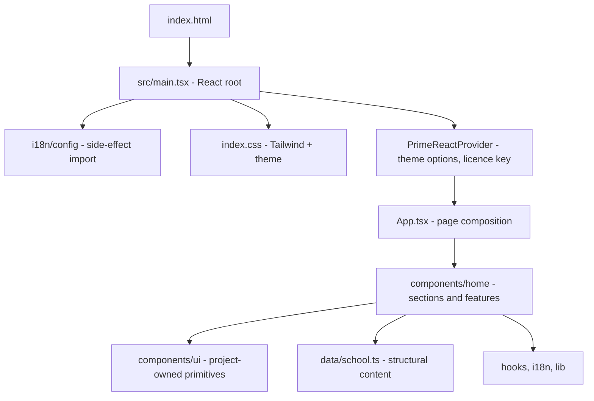

# Frontend architecture

`school-ui` is a **client-rendered React single-page application** built with Vite. It
currently serves one thing: the public marketing and lead-capture home page for Elven
Driving School, in English, Sinhala and Tamil.

> **Status.** The page is complete end to end against local content. There is no HTTP
> layer, no router and no test suite yet — see [Deliberate omissions](#deliberate-omissions)
> for what that means and what would change when the `school-ba` API arrives.

## Documents

| Document | Read it for |
| --- | --- |
| [Composition](composition.md) | Layers, module boundaries, allowed dependency directions |
| [Styling and theming](styling-and-theming.md) | Tailwind 4, PrimeReact Tailwind mode, design tokens, dark mode |
| [Internationalization](internationalization.md) | The two translation layers and how they stay in sync |
| [State and data](state-and-data.md) | Where state lives, the local content layer, the future API seam |
| [Build and tooling](build-and-tooling.md) | Vite, the split TypeScript configs, ESLint, environment variables |
| [App shell](app-shell.md) | *Proposal* — the authenticated layout, permission-driven navigation, access enforcement |

For *what* the product must do rather than how it is built — scope, functional
requirements, business rules and open questions — see
[business requirements](../business-requirements/README.md).
For authenticated UI behavior, treat
[administration requirements](../business-requirements/administration-requirements.md) as
the canonical security policy and [app shell](app-shell.md) as its proposed frontend
projection.

## The shape of the app

There is exactly one route, one React root and one provider. Everything a visitor sees is
composed in [`App.tsx`](../../../../school-ui/src/App.tsx), which renders the header, eight sections in
page order, the footer, the phone-only action bar, and a single toast outlet.

## Decisions and their reasons

| Decision | Why | Cost accepted |
| --- | --- | --- |
| **Vite SPA, not Next.js** | The page is a single document with no server-side data. SSR would add a runtime to deploy for no rendering benefit. | No SSR/SSG, so no crawler-ready HTML without adding prerendering later. |
| **PrimeReact in Tailwind mode** | Component source is copied into `src/components/ui/` and owned by this repo, so restyling is editing local code rather than fighting a packaged stylesheet. | Registry updates are a re-run of the CLI plus a manual diff, not an `npm update`. |
| **Design tokens over per-component CSS** | One theme file (`themes/elven-yellow.css`) redefines the `--p-*` variables every component already reads, so the whole palette changes in one place. | Anything not expressed as a token still has to be styled per component. |
| **Flat i18next keys** | Keys such as `course.car-manual.name` are built by string concatenation from record ids, so a nested lookup would be ambiguous where ids contain dots. | `keySeparator` and `nsSeparator` must stay disabled; namespaces are unavailable. |
| **Content split: ids here, prose in catalogues** | `data/school.ts` holds only what does not change with language, so adding a language never touches the data file. | Reading a record means two lookups — the record and its translation. |
| **Local `useState`, no store** | Nothing is shared between sections; the one form owns its own fields. A store would be ceremony around a single component. | Introducing cross-section state later needs a deliberate choice, not an incremental hack. |
| **Composition wrappers over prop-heavy components** | `Section` and `FormSelect` absorb repetition that would otherwise be copy-pasted per section or per field. | One more indirection between the page and the primitive. |

## Deliberate omissions

These are absent by choice, not oversight. Each note says what would have to change.

- **No HTTP/data layer.** `VITE_API_BASE_URL` is already declared in `.env.example` but
  unused. The booking form confirms with a toast instead of posting. See
  [State and data → The API seam](state-and-data.md#the-api-seam).
- **No router.** Navigation is in-page anchors with `scroll-margin` offsets and an
  `IntersectionObserver` marking the active section. A second page means adding a router
  and lifting `App`'s body into a route component.
- **No test suite.** There are no test dependencies installed. `npm run build` (which
  type-checks via `tsc -b`) and `npm run lint` are the only automated gates today.
- **No form validation beyond completeness.** `BookingCard` enables submit when all five
  fields are non-empty. Real validation belongs with the API contract that will reject
  bad input.
- **Dark mode is not persisted.** The toggle writes the `dark` class onto
  `documentElement` and reads its initial value back from that class, so a reload returns
  to light and `prefers-color-scheme` is not consulted. See
  [Styling and theming → Dark mode](styling-and-theming.md#dark-mode).
- **`src/assets/` is unreferenced.** `hero.png`, `react.svg` and `vite.svg` are scaffold
  leftovers; the hero illustration is the inline SVG in `DrivingLessonBackdrop.tsx`.
