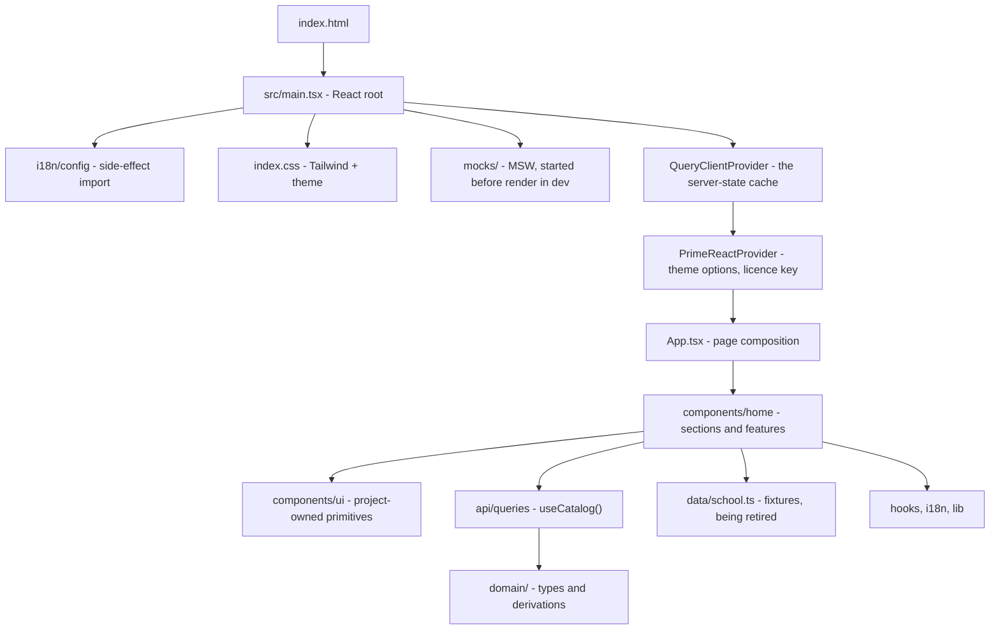

# Frontend architecture

`school-ui` is a **client-rendered React single-page application** built with Vite. It
currently serves one thing: the public marketing and lead-capture home page for Elven
Driving School, in English, Sinhala and Tamil.

> **Status.** The page is complete end to end, React Router carries both it and the
> authenticated shell, and there is now an [API layer](api-layer.md): axios behind
> TanStack Query, with a mock server standing in until `school-ba` serves the catalogue.
> One section reads through it; the rest still read local records. There is no test suite
> — see [Deliberate omissions](#deliberate-omissions).

## Documents

| Document | Read it for |
| --- | --- |
| [Composition](composition.md) | Layers, module boundaries, allowed dependency directions |
| [Styling and theming](styling-and-theming.md) | Tailwind 4, PrimeReact Tailwind mode, design tokens, dark mode |
| [Internationalization](internationalization.md) | The two translation layers and how they stay in sync |
| [State and data](state-and-data.md) | Where state lives, the local content layer, the future API seam |
| [API layer](api-layer.md) | axios, TanStack Query, the domain types, error handling, cache keys, the mock API |
| [Build and tooling](build-and-tooling.md) | Vite, the split TypeScript configs, ESLint, environment variables |
| [App shell](app-shell.md) | *Proposal* — the authenticated layout, permission-driven navigation, access enforcement |

For *what* the product must do rather than how it is built — scope, functional
requirements, business rules and open questions — see
[business requirements](../business-requirements/README.md).
For authenticated UI behavior, treat
[administration requirements](../business-requirements/administration-requirements.md) as
the canonical security policy and [app shell](app-shell.md) as its proposed frontend
projection.

## The shape of the app

[`App.tsx`](../../../../school-ui/src/App.tsx) is a `RouterProvider` over the route table in
[`routes.tsx`](../../../../school-ui/src/routes.tsx). That table holds two trees: the public site at
the root, composed in [`pages/HomePage.tsx`](../../../../school-ui/src/pages/HomePage.tsx) — header,
eight sections in page order, footer, phone-only action bar, one toast outlet — and the
signed-in shell under `/app`, composed in [`app/AppShell.tsx`](../../../../school-ui/src/app/AppShell.tsx).

`/`, `/login` and `/register` all render the home page; the last two only select which card
the hero shows.

## Decisions and their reasons

| Decision | Why | Cost accepted |
| --- | --- | --- |
| **Vite SPA, not Next.js** | The page is a single document with no server-side data. SSR would add a runtime to deploy for no rendering benefit. | No SSR/SSG, so no crawler-ready HTML without adding prerendering later. |
| **React Router, `createBrowserRouter`, no loaders** | The route table is data built from the same `navItems` list the sidebar reads, so a destination cannot be visible and unroutable. Object config leaves room for route `loader`s without committing to React Router as the data layer before the API seam exists. | Real paths need an SPA fallback rewrite wherever the built site is hosted, and ~32 kB gzipped. |
| **PrimeReact in Tailwind mode** | Component source is copied into `src/components/ui/` and owned by this repo, so restyling is editing local code rather than fighting a packaged stylesheet. | Registry updates are a re-run of the CLI plus a manual diff, not an `npm update`. |
| **Design tokens over per-component CSS** | One theme file (`themes/elven-yellow.css`) redefines the `--p-*` variables every component already reads, so the whole palette changes in one place. | Anything not expressed as a token still has to be styled per component. |
| **Flat i18next keys** | Keys such as `course.car-manual.name` are built by string concatenation from record ids, so a nested lookup would be ambiguous where ids contain dots. | `keySeparator` and `nsSeparator` must stay disabled; namespaces are unavailable. |
| **Content split: ids here, prose in catalogues** | `data/school.ts` holds only what does not change with language, so adding a language never touches the data file. | Reading a record means two lookups — the record and its translation. |
| **Local `useState` for client state, no store** | Nothing client-side is shared between sections; the one form owns its own fields. A store would be ceremony around a single component. Server state is a different problem and has its own answer, below. | Genuinely page-wide client values (the session, the selected branch) are contexts, chosen one at a time. |
| **TanStack Query for server state, axios as transport** | They are different layers, not alternatives: axios sends a request, Query owns when data is fetched, what is cached, and what a mutation invalidates. Hand-rolling that per section reinvents dedupe, cancellation and refetch badly, and the required "sign-out clears protected cached data" is unimplementable without one cache to clear. | ~13 kB gzipped and one more concept. See [API layer](api-layer.md). |
| **Composition wrappers over prop-heavy components** | `Section` and `FormSelect` absorb repetition that would otherwise be copy-pasted per section or per field. | One more indirection between the page and the primitive. |

## Deliberate omissions

These are absent by choice, not oversight. Each note says what would have to change.

- **No writes yet.** The API layer reads; nothing posts. Registration is the first write to
  build, and the contract doc still describes trial booking in its place. See
  [API layer → What is not built yet](api-layer.md#what-is-not-built-yet).
- **Only one section reads through the API layer.** `CoursesSection` is the reference; the
  other seven still import records from `data/school.ts`, which keeps a bound-helper bridge
  alive for exactly that reason. See
  [API layer → Migrating a section](api-layer.md#migrating-a-section).
- **No route-level data loading.** Routes are declared with `createBrowserRouter` but no
  route defines a `loader` or `action`. Data loading went to TanStack Query instead —
  loaders have no cache and no post-mutation invalidation, and coupling them to a route
  table generated from `navItems` knots two things that change for different reasons.
  Within the home page, section navigation is still in-page anchors with `scroll-margin`
  offsets and an `IntersectionObserver` marking the active section.
- **No route-level code splitting.** Every page is in the entry bundle, which is already
  past Vite's 500 kB warning. `lazy` on the `/app` children is the fix when it starts to
  matter.
- **No SPA fallback committed to the repo.** `vite dev` and `vite preview` serve
  `index.html` for unknown paths, so deep links work locally. A static host needs the
  equivalent rewrite configured, or `/app/my-lessons` 404s on a hard refresh.
- **No test suite.** There are no test dependencies installed. `npm run build` (which
  type-checks via `tsc -b`) and `npm run lint` are the only automated gates today.
- **No form validation beyond completeness.** `BookingCard` enables submit when all five
  fields are non-empty. Real validation belongs with the API contract that will reject
  bad input.
- **Dark mode is not persisted.** The toggle writes the `dark` class onto
  `documentElement` and reads its initial value back from that class, so a reload returns
  to light and `prefers-color-scheme` is not consulted. See
  [Styling and theming → Dark mode](styling-and-theming.md#dark-mode).
- **`src/assets/` is unreferenced.** `hero.png`, `react.svg` and `vite.svg` are scaffold
  leftovers; the hero illustration is the inline SVG in `DrivingLessonBackdrop.tsx`.
