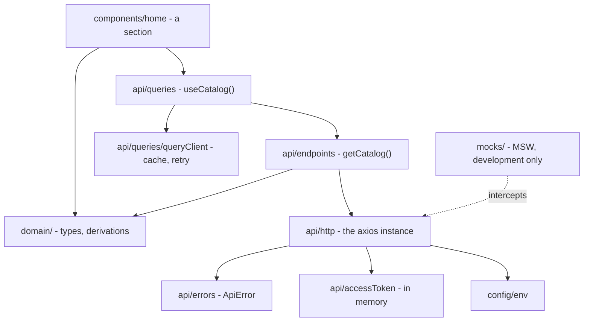

# API layer

[← Frontend architecture](README.md)

How `school-ui` talks to `school-ba`: the modules involved, which way they may depend on
each other, and the decisions behind each one.

> **Status.** The layer is built and one section reads through it. `school-ba` does not
> serve the catalogue yet, so a mock API answers in development — over real HTTP, through
> a Service Worker, so nothing above it knows the difference. See
> [The mock API](#the-mock-api) and [What is not built yet](#what-is-not-built-yet).

## The shape of it



| Module | Owns |
| --- | --- |
| [`config/env.ts`](../../../src/config/env.ts) | Reading `import.meta.env` once, with defaults |
| [`domain/`](../../../src/domain/) | Response types and the pure functions that read them |
| [`api/http.ts`](../../../src/api/http.ts) | The single axios instance and its interceptors |
| [`api/errors.ts`](../../../src/api/errors.ts) | `ApiError` — the one failure type |
| [`api/accessToken.ts`](../../../src/api/accessToken.ts) | The access token, in memory, and session-end notification |
| [`api/endpoints/`](../../../src/api/endpoints/) | One module per backend controller; plain async functions |
| [`api/queries/`](../../../src/api/queries/) | Cache keys, the query client, one hook per query |
| [`mocks/`](../../../src/mocks/) | MSW handlers standing in for endpoints `school-ba` has not built |

## Dependency rule

The rule from [Composition](composition.md#dependency-rule) extends downward:

```
home/, app/ → api/queries → api/endpoints → api/http → api/errors, api/accessToken, config/
     ↘ domain/ ↙
```

Concretely:

- **`domain/` imports nothing from the application.** It is types and pure functions. Both
  `api/` (which produces catalogues) and components (which consume them) depend on it, and
  that is what stops them depending on each other.
- **`api/endpoints/` imports no React.** An endpoint is callable from a hook, a route
  loader, a mutation, or a test.
- **Nothing outside `api/http.ts` imports `axios`.** That is the rule the whole layer rests
  on — see below.
- **`components/ui/` never imports `api/`.** A primitive that knows about courses is no
  longer a primitive; that has not changed.

## Decisions and their reasons

| Decision | Why | Cost accepted |
| --- | --- | --- |
| **One axios instance, never a bare `axios` call** | Base URL, credentials, timeout, bearer token and error normalisation are configured once. A call site cannot opt out of any of them by accident. | An endpoint needing different behaviour has to say so per request rather than reaching for `axios` directly. |
| **TanStack Query over the instance** | axios is transport; something has to own *when* data is fetched, what is cached, and what is invalidated. Without it, every section reinvents loading state, dedupe, cancellation and refetch-after-mutation — badly. | ~13 kB gzipped and one more concept to learn. |
| **Query rather than route `loader`s** | The route table is generated from `navItems` ([routes.tsx](../../../src/routes.tsx)); coupling data loading to that generation knots two things that change for different reasons. Loaders also have no cache and no invalidation. | Route transitions do not block on data; sections render their own loading state. |
| **One `/school/catalog` endpoint, not nine** | The home page renders all of it at once — nine endpoints would be nine round trips for one screen — and the relationships between records (`Testimonial.branchId`, `BranchOffer.courseId`) are only sound if the slices came from the same read. | The `/app` shell pays for catalogue records it may not render. |
| **Relative `/api` base URL, proxied in dev** | Keeps the browser on one origin. The `school_refresh` cookie is `SameSite=Strict`, so a page on `:5173` calling `:8080` is cross-site and the cookie is withheld — refresh would fail locally and only locally. | The dev proxy target is hardcoded in [vite.config.ts](../../../vite.config.ts); a different backend port needs an edit there or an absolute `VITE_API_BASE_URL`. |
| **Access token in memory only** | Required by [state-and-data.md](state-and-data.md#authenticated-state-future) and [api-contracts.md](../backend/api-contracts.md#authentication). Anything script can read, injected script can read. | A page reload has no token and must re-establish the session from the refresh cookie. |
| **Errors normalised to `ApiError` at the interceptor** | Axios throws three different things — a rejected response, no response, an abort — through one channel. Sorting that out per call site is how eight sections end up with eight ideas of "failed". | One more type between the wire and the component. |
| **Loading and error rendered by `Section`** | Eight sections would otherwise invent eight skeletons and eight error messages. | `Section` now knows about `ApiError`, so it is no longer a pure layout primitive. |
| **MSW rather than a fixture fallback** | The app does real HTTP against a mock server: interceptors run, requests appear in the Network panel, loading and error states are genuine. A fallback to local imports would leave the seam untested until the day the backend arrives. | A committed generated worker in `public/`, and a dev dependency. |

## Errors, end to end

The contract's shape ([api-contracts.md](../backend/api-contracts.md#error-shape)):

```json
{ "code": "VALIDATION_FAILED", "message": "...", "fields": { "branchId": "..." } }
```

1. The response interceptor calls `toApiError`, which is **total**: it takes `unknown` and
   always returns an `ApiError`. A `catch` cannot promise what it caught, and a data layer
   that throws two shapes has not solved the problem it set out to solve.
2. Failures that never reached the server get a client code from `CLIENT_ERROR_CODES` —
   `NETWORK_UNREACHABLE`, `REQUEST_TIMEOUT`, `REQUEST_CANCELLED` — spelled the same way so
   one `error.*` lookup covers both origins.
3. `error.isRetryable` decides whether React Query retries. The library's default retries
   everything three times, which turns a 404 or a rejected form into a four-second wait
   before the user is told what is wrong.
4. The component renders `t(error.translationKey)`. **Backend messages are never shown**:
   they are developer-facing by contract and are not translated. An unrecognised code falls
   back to `error.UNKNOWN_ERROR` via i18next's `defaultValue`, so a new backend code
   degrades to a generic sentence rather than printing `error.SOMETHING_NEW` on the page.
5. `error.fields` maps straight onto form field errors when validation fails.

`@tanstack/react-query`'s `Register` interface is augmented in
[queryClient.ts](../../../src/api/queries/queryClient.ts) so `error` is typed `ApiError` at
every call site without a cast.

## Cache keys and authorisation

Keys are built in [keys.ts](../../../src/api/queries/keys.ts), never spelled inline — an
inline key is a cache entry nothing else can find or invalidate.

The rule that matters once anything is behind a login:

> **Every protected key includes `authScope(context)`.**

Two people on the same page are authorised over different rows: a coordinator at Wellawatte
and one at Battaramulla hold the same `student.view` over different students, so a key of
`['students']` would serve one branch's roll to the other. The branch a visitor has
*selected* on the public site is not this — that is interface context, and a school-scope
focus filter never converts into a branch grant.

Session end is wired once: `clearAccessToken()` fires its listeners, and
`queryClient.clear()` is one of them. That is what makes "sign-out clears protected cached
data" true by construction rather than by everyone remembering. Every sign-out, session
invalidation and failed refresh must go through that function.

## The mock API

`npm run dev` starts [MSW](../../../src/mocks/browser.ts) and serves the catalogue from the
fixtures in [`data/school.ts`](../../../src/data/school.ts).

- On by default in development; `VITE_API_MOCK=false` turns it off. **Production builds
  never mock**, whatever the variable says — a mocked production bundle would serve
  fixtures to real visitors, which is the one failure mode worth making impossible rather
  than merely unlikely.
- `main.tsx` guards the dynamic import with `import.meta.env.DEV` as well as the runtime
  flag. Vite replaces that with a literal, so the bundler can prove the branch is dead and
  drop the msw chunk; without it a 400 kB worker is emitted into `dist/` and merely never
  loaded.
- Rendering waits for `worker.start()`. If the app mounted first, the queries fired on its
  first render would race the worker's activation and some would escape to the network —
  an intermittent, unreproducible failure.
- Handlers answer after a 250 ms delay, so the skeleton is visible. A mock that answers
  instantly hides the state most likely to be wrong and least likely to be noticed.
- `public/mockServiceWorker.js` is generated by `npx msw init public` and committed, so the
  mock works on a fresh clone. Re-run it when msw is upgraded. It is in the ESLint ignore
  list because it is upstream's file, not ours.

## Migrating a section

[`CoursesSection`](../../../src/components/home/CoursesSection.tsx) is the reference. The
recipe:

1. Replace module-scope imports from `data/school.ts` with `useCatalog()`.
2. Pass `loading={isPending}`, `error={error}` and `onRetry` to `Section`. Do not render a
   skeleton or an error message in the section itself. A section whose body is not a card
   grid passes its own `skeleton`.
3. Call the derivations from `domain/school.ts` with the catalogue this render is working
   with — `coursesAtBranch(catalog, branchId)`, not the bound wrapper. That is what stops
   one request's branches being read against another's courses.
4. Push data lookups out of leaf components. `CourseCard` now takes `price` instead of
   calling `priceAt`, which leaves it with no data dependency at all.
5. Derive, do not store, anything the catalogue can retire. The open tab is derived from
   the classes this branch teaches, so arriving data cannot leave a tab selected that no
   longer exists.

Sections calling `useCatalog()` do **not** need the catalogue threaded down from
`HomePage`: React Query dedupes on the key, so eight sections still produce one request.

### `data/school.ts` during the migration

The file is now fixtures plus a bridge. It re-exposes the derivation helpers bound to its
own records, purely so unmigrated sections keep compiling; the real ones live in
`domain/school.ts` and take their data as an argument. Every migrated section drops an
import from it, and when the last one does, what remains is fixtures and the file moves
under `src/mocks/`. **Nothing new should import it.**

## What is not built yet

- **Refresh on 401.** The interceptor is the right place and the comment says so. It needs
  `POST /api/auth/refresh`, which `school-ba` does not serve. When it lands it must be a
  single shared in-flight promise — ten requests failing at once produce one refresh, not
  ten — and must call `clearAccessToken()` when the refresh itself fails.
- **CSRF.** `GET /api/auth/csrf` returns the token *and the header name* to use, so this is
  not axios's built-in `xsrfCookieName`/`xsrfHeaderName`: both values have to be fetched
  and cached, then set on mutating requests.
- **Session bootstrap.** [`useSession`](../../../src/auth/useSession.ts) is still an empty
  seam. Filling it is what makes `authScope` load-bearing.
- **The other seven sections**, plus `selectedBranch`, which currently defaults from the
  fixture `primaryBranch`.
- **The first write.** Registration, from
  [`RegisterCard`](../../../src/components/home/RegisterCard.tsx). Note that
  [api-contracts.md](../backend/api-contracts.md#public-booking-submission) still documents
  `POST /api/bookings/trial` as the first write; that is stale — trial booking is being
  removed, and the contract needs a registration endpoint in its place.
- **Tests.** MSW is the piece that makes them cheap when they arrive: the same handlers run
  under Node.
