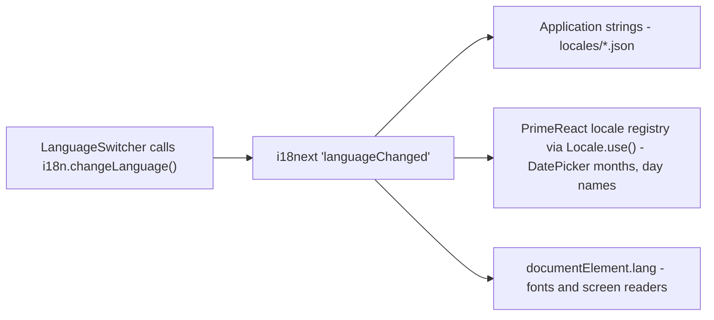

# Internationalization

[← Frontend architecture](README.md)

Three languages ship: English (`en`), Sinhala (`si`) and Tamil (`ta`), declared once as
`SUPPORTED_LANGUAGES` in [`i18n/config.ts`](../../../src/i18n/config.ts).

## Two translation layers

This is the central fact of the i18n design. **Two independent systems own strings, and
they must agree on the active language.**



- **i18next** owns every string the site itself renders, from `src/locales/*.json`.
- **PrimeReact** owns the strings baked into its own components — the DatePicker's month
  and day names above all — read from its own registry, which knows nothing about i18next.

`syncPrimeReactLocale` is the join. It is subscribed to i18next's `languageChanged` event
and *also* called once at module load, because the language detector resolves a language
before the listener is attached.

Sinhala and Tamil are not in [PrimeLocale](https://github.com/primefaces/primelocale), so
their definitions are hand-written in
[`i18n/primeLocales.ts`](../../../src/i18n/primeLocales.ts) and registered with
`defineLocale`. Each spreads `en` first — a registered locale must be **complete**, since
omitted keys resolve to `undefined` and render as empty labels rather than falling back to
English.

## Key conventions

Keys are **flat strings**: `keySeparator` and `nsSeparator` are both disabled, so
`"hero.titleLead"` is looked up verbatim rather than as a path into a nested object. This
is what lets keys be built from record ids by concatenation:

```tsx
t(`course.${course.id}.name`)     // course.car-manual.name
t(`branch.${branch.id}.address`)  // branch.rajagiriya.address
```

Adding a record to `data/school.ts` therefore means adding its keys to **all three**
catalogues — a missing key falls back to English, and a missing English key renders the
key itself. The three files are line-for-line parallel; keep them that way.

`interpolation.escapeValue` is off because React escapes on render already; leaving it on
would double-encode interpolated values.

## Language selection and persistence

`i18next-browser-languagedetector` resolves in order `localStorage` → `navigator`, caching
the choice under `school-ui.language`. (This is the one piece of persisted UI state in the
app — the theme toggle deliberately has none.)

`LanguageSwitcher` renders all three options inline rather than in a dropdown: with three
languages a popup costs a click and hides the very thing a reader is scanning for. Each
option is written **in its own script** and carries its own `lang` attribute.

## Scripts and fonts

Sinhala and Tamil have unreliable system font coverage — Windows and older Android render
tofu without a webfont. Two mechanisms cover this:

1. `index.html` preconnects to Google Fonts and loads Noto Sans Sinhala and Noto Sans
   Tamil.
2. `syncDocumentLanguage` keeps `document.documentElement.lang` in step with the active
   language, and `index.css` selects the face with `:lang(si)` / `:lang(ta)`.

Because the switcher marks each option with its own `lang`, the right face is used both
for the page and for the individual options inside an otherwise-English page. Both scripts
are left-to-right, so no direction handling is needed — RTL would mean revisiting this and
`components.json`'s `"rtl": false`.

## Numbers, money and dates

Formatting is split by *what varies with language*:

| Concern | Where | Why |
| --- | --- | --- |
| Digit grouping | `formatAmount` in `data/school.ts` (`toLocaleString('en-LK')`) | Grouping is the same in all three |
| Currency prefix | `currency.amount` message (`Rs` / `රු.` / `ரூ.`) | Written differently per language |
| Combining the two | `useMoney` hook | Memoised on `t`, so callers can list it as a `useMemo` dependency |
| Dates | `DATE_LOCALES` in `BookingCard` | Maps the i18next code to a BCP 47 tag (`en` → `en-GB`) |
| Plurals | i18next `count` option | `t('courses.lessons', { count })` picks the right plural form |

Always format money through `useMoney` rather than interpolating a number — the prefix
would otherwise be hard-coded English.
